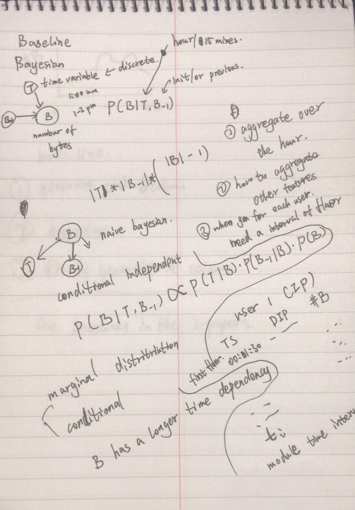
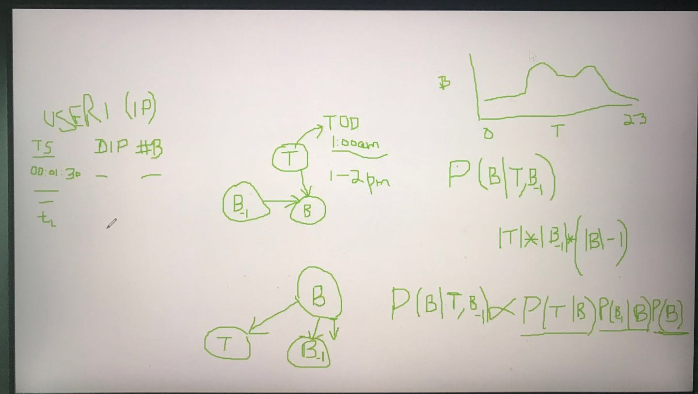

# Feb 1 Meeting Keynote

## Clarification about data

We want all day 1 records that include local ip addresses in SourceA _*or*_ DestinationA. 

For a entire day, find 10/20 users occurs the most, and how many times they occures, in SA or DA.

Look at each user over time temporally, instead of mixing all users together. For each hour or 15 minutes.

## Bayesian Approach

### probability estimating

poisson distribution drawback: it's a uni distribution and an unidirectional could be better.

Thus: gaussian mixed model may be better.

Don't use MCMC and a Maximum Likelihood Estimates may be good. When fitting particular distribution compute likelihood of 2 cases. (ex. log likelihood).

### joint distribution

See the following picture.

## Key points and to consider

1. we currently aggregate over the hour.

2. how to aggregate other features.

3. when go for each user, need an interval of destination/timestamp.

4. our baseline targets:
    
    generate each column independently

    bayesian network to combine columns

    finally generate all columns together

5. check baselines in the 2 papers.