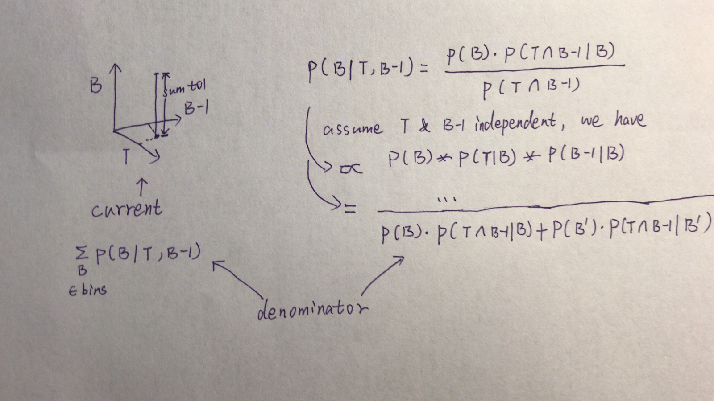
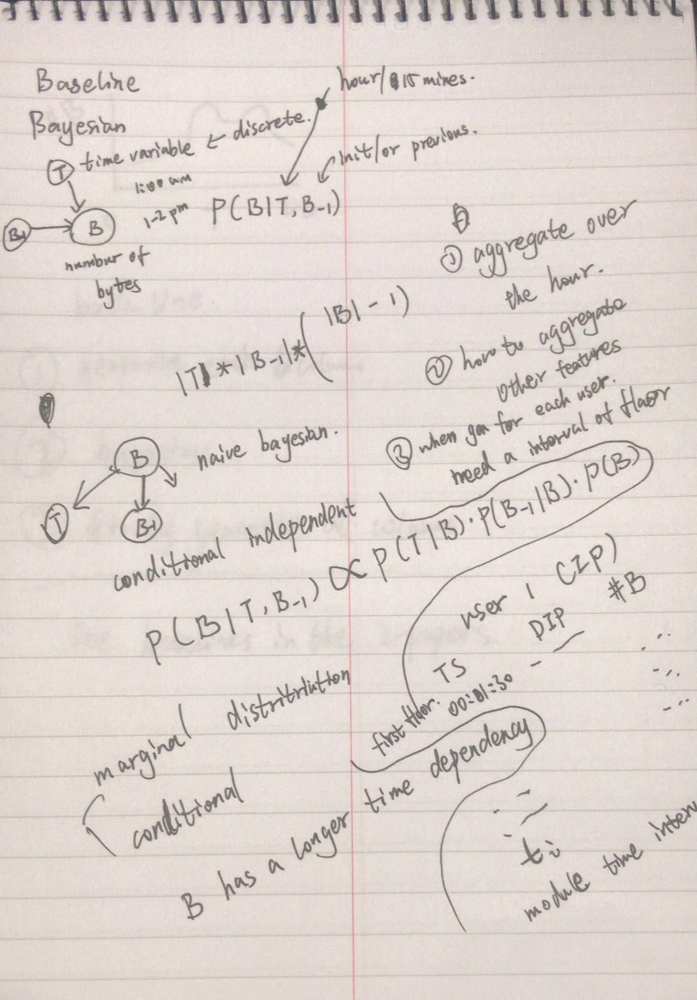
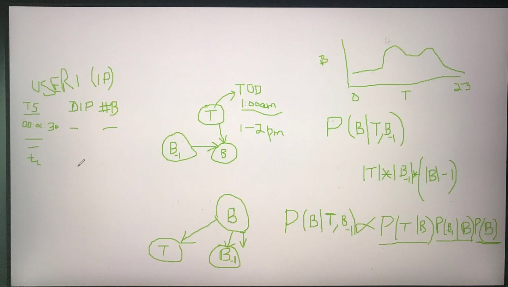

# June 14 plan & discussion

1. run baseline1 5 repeat experiments

2. refine the likelihood calculation

# June 13 plan

Do 1-4 work in the discussion, and read paper to prepare 5-7

1. do fixed ylim for show #bytperflow & hour-conditioned distribution

2. implement for calculate average time-conditioned JS

# June 12 discussion

Discussion

1. make y axis the same for all

2. repeat 5/10 times baseline1 to check whether there is temporal behaviour.

3. overall JS: baseline1 can better than baseline2
   average time-conditioned JS: baseline2 should be better

4. likelihood. Write down the likelihood formula.
   Because since real data shows temporal behaviour, the baseline2 joint distribution should be larger.

5. for our design: each feature should be one word -> and has a embedding.

6. to find paper about text autoregressive model.

7. read compare CNN/RNN temporal paper.

# June 10th plan

1. debug for baseline2.

2. question:
    pixelcnn model the dependency based on human-defined dependency (spatial relationship between the pixels)
    in our case, since the dependency in the tabular data is not a "clear and intuitive" one, should we still build it in this way.

# June 8th, 9th plan

read papers and pytorch tutorials.

picture with CNN, picture with RNN
text with RNN, text with CNN

# June 7th Fri discussion

1. T -> hour of the day / date of the week / someday previous week

2. d_t: -> dependent on other features.

3. KL divergency strange -> try to use another metric genson_shanon divergence which is a normalized one.

4. about normalization: sum up approach should be the same as the formular.
    

# June 6th Thu plan

1. design the NN model

2. figure out the trend problem of figure 2.

# June 4th Tue plan & discussion

1. try smaller bins number.

2. raw data trend is good.

# June 3rd Mon plan

1. Question: the more bins we have, after the normalization, the probability absolute value for each bin is smaller.
    Then the likelihood would go more bad. Does this makes sense?

    Maybe not able to compare baseline1 and baseline2, if the metric is different

2. the shape of baseline3 looks better, but the absolute value still very large.
    Maybe it's because many rows' byt very small?

3. validating results

# June 2nd Sun plan

1. [Done] fix: baseline2 save_model memory error

2. [Done] baseline2: likelihood calculation too slow

3. [Done] baseline2: generation part, find bin function accelarating

4. [Done] baseline1: sample more to a pool to speed up

# June 1st Sat plan

1. upload to the gans server and try running there
    Done, using screen and venv

2. accelerating the find bin into binary search

# May 31 Fri plan & discussion

1. paper whole picture discussion

    As a good paper, we first include most of the network flow attributes. We build solution/architecture for generating network data.
    The data have similar format/major of the fields. Then compare to the baselines.

    As a conclusion, the body of this work has: 1. gen major attributes; 2. do validation on ML tasks.

2. how do we validate the generated data that NN model is better?
    It's the same question that how well the data is good for predictive tasks.
    
    2.1 For example, using other fields to predict the one, like protocol.
    compare gen data <-> real data (test). Should have similar results.
    
    2.2 time-dependent task (harder)

    This'll show gen data is subtitude for real data for ML tasks.

3. To achieve this, we should design carefully that how we can distinguish ours with prior works.

4. We can also use domain knowledge to constrain the training/validation

5. For the delta_T attrbute, if we want to build the relationship between d_T and hour of the day.

    To make it simple, first check the linear dependency (correlation co-efficiency). if it -> 0, just do what we already have.

    Otherwise, maybe try poison distribution

6. fixed baseline2 log-likelihood for multi-user start byt-1 problem

# May 30 Thu plan

1. work on 5 tasks mentioned yesterday.

2. read papers and thinking.

# May 29 Wed plan and discussion

for type 3 users: external sites are doing port scanning attack

1. for 4 categories, plot time distribution for #byt, #flow

2. for 695 select middle users -> show temperal behaviour of them

3. how many of them in our previous 100 users is in type 0
    only 3 of our previous chosen users belongs to type 0. ['42.219.158.210', '42.219.157.26', '42.219.153.13']

4. to correct: do normalization in step 2 and do laplacian only in step 1. Use log sum exp trick, and for each B-1, T, the sum of P(B|B-1, T) for all B, should be 1.
    Done

5. step3, sample from the table[t][b-1], instead of argmax
    Done

# May 28 Tue plan

1. local hosts types: # both sent&recieve, only sent to ex, only recieve from ex, interal-to-internal
    [695, 0, 3401, 292]

2. designed workflow for the NN model (refer to the pixelCNN++ implementation)
    input process

    NN structure
    loss function

    train process

3. how many contents can be enough to make one publication?
    3.1 we already planned to model and generate the network table (meta attributes).

4. bsl2 average log-likelihood -4.394703373188085
   bsl1 average log-likelihood -1.74

# May 27 Mon plan

1. looks #flow (time-delta) is better to model conditioned on the hour T; we can do both for the time being

2. survery how many users are there in three categories:
    
    local hosts
    - only sent to ex
    - only recieve from ex
    - both sent & receive [we focus]
    - interal to interal [ignore]

3. Do debug for baseline 2
    1. do laplacian smoothing (which already includes normolization) for 
        learnt_p_B_gv_T_B1[t][interval_1][interval] = p_T_B[t][interval] * p_B[interval] * p_B1_B[interval_1][interval]
    2. laplacian smoothing (which already includes dealing with 0 Denominator situation (same probability to all terms))

4. read papers <>

# May 24 discussion

1. Timeline of AAAI & ask for twice meeting a week

2. for the PixelCNN++the loss function of the NN is the negative log likelihood

3. debug for baseline2 [nan issue] and GMM pr for an interval shouldn't be negative.
    > 2.0 We use P(B|B-1, T) = P(T|B) * P(B-1|B) * P(B)

    > 2.1 To calculate P(B)
        for the GMM, it provide the score_sample() function with the PDF(probability density function, log-shape)
        
        Since the B here is an interval, we use "integrate" to calculate it on the PDF
        
        Note that: the value of a single pont on the PDF may larger than 1, but the integrate of the whole range of the PDF -> 1
    > 2.2 Do Laplacian smoothing for the distribution of B (df.size)

# May 23 plan

1. analyze different users hour distribution

2. prepare slides for tomorrow

3. read paper and implement the "pixelCNN for our case"

# May 22 plan
1. implement the "pixelCNN for our case"

# May 21 plan: Done

1. how pixelcnn++ calculate the log-likelihood? 1. For d in test_data; 2. feed d to session.run, and get loss(probability); 3. mean of all loss.

2. Then for our baseline2: 1. just for d in test_data; 2.use d(byt, byt-1, T) to check the trained table and get the log-probability. 3. mean of all pr

# May 18&19 plan

1. generate 100 users 1 day, Done

2. draw 100 raw user hour distribution

3. split baseline2 training and testing

# May 10th meeting

Observation: most of the traffic are incoming traffic, I mean the user_i is on the destination_ip position.
61898 rows, 100 users, training data

generate 10 days, 1 user, 6168 rows for baseline 1
6154 rows for baseline 1

bin_size selection
https://en.wikipedia.org/wiki/Freedman%E2%80%93Diaconis_rule
http://docs.astropy.org/en/stable/api/astropy.stats.freedman_bin_width.html#astropy.stats.freedman_bin_width
http://www.jtrive.com/determining-histogram-bin-width-using-the-freedman-diaconis-rule.html

GMM clusters selection
https://notebooks.azure.com/api/user/Microsoft/library/biRjqEpoXjA/html/04.3-Density-GMM.ipynb

# May 3rd meeting

## discussion

1. incoming & outgoining traffic is not independent. We want to model their byt together and distinguish their direction seperately. (build model for P(outgoing) & P(incoming))

2. bar number should be the sqrt of the data point number in stead of value range.

3. For each bin, to generate value in [the bin], just assum a uniform even probability for the time being.

4. check why (10-23)hour results are too good.

## preparation

current job. Run. check baseline2 intergrate

5. laplacian smoothing 
https://www.youtube.com/watch?v=gCI-ZC7irbY

4. question: for baseline2, what we generated is the probability of a bin. Like ['3', '6', '9', '12', '15', '18', '21']
    that we can select a argmax(P[3-6), P[6-9), P[9-12) ... ). How to generate a accurate byt? Currently uniform sample a value from the selected range like [6, 9)

    baseline2: also marginal distribution for first line, then joint distribution for later.

0. log e

1. should all bins edges should be fixed or it can be depends on the different user data?
    current solution:
        during preprocess the raw data, extract the max and min value of 10 users byt.
        based on this overall max and min value to decide the bins for all 10 users.

2. 788 user, 76710307 flows in total.
42.219.155.70: 4137
42.219.155.20: 4114
42.219.153.113: 4113
42.219.170.246: 4081
42.219.158.243: 4073
42.219.153.48: 4044
42.219.154.172: 3983
42.219.153.165: 3979
42.219.145.70: 3964
42.219.155.12: 3953

3. workflow
3.1 analyze data, get user_list and extract their data
python3 .\datasets\analyze_and_extract_ugr16.py -p -e

3.2 to preprocess data and generate the bins
python3 .\process_ugr16_data.py -f

3.3

# April 30th Q&A notes

1. do laplacian smoothing before log, so that our Q(i) coundn't be 0.

2. Bin width: do equal width for now. Bin number: wikipedia heuristics. Maybe based on howmany data points that we have, then use the square root of #data points.
https://www.statisticshowto.datasciencecentral.com/choose-bin-sizes-statistics/

3. user selection: focus internal address. how many flows. user in the enterpreise.

# April 26th meeting notes

## preparation

To write in the latex notebook
1. Get the stats of the day 1 data. Select the flows that both Source Address and Target Address are internal ip (starting with 42.219.*.*), which are our current research target.

2. As a result, which is quite different with our previous outgoing traffic data.
   Got 732 users and 206300 flows; storing in data_stats.csv.
   598 users have only 1 flow record. So we don't need to select users with medium #flow, but selected top ten users. Note that, top 2 users have much more #flow than the 3rd or 4th user, which may because they are server or port scanning something like we disccussed last week.

3. So we selected 12 users and draw the T distribution for each of them.
81099,42.219.159.221
78562,42.219.159.179
19270,42.219.159.182
5051,42.219.159.186
4081,42.219.170.246
3871,42.219.159.199
3102,42.219.159.171
2221,42.219.159.195
2156,42.219.159.76
1881,42.219.159.118
1587,42.219.159.170
228,42.219.159.95

4. extract the data of the ten users as 10 csv files. (raw_data/day1_%ip.csv) and pre-process them to get 10 csv files. (cleaned_data/extended_day1_%ip.csv)

strange finding: for day_1_42.219.170.246: the byt of all its flow are 64.

5. run the run_exp.py and train a model for the 10 users.

6. generate data
    1 user, 10 days, 49648 rows, baseline1
    1 user, 10 days, 49229 rows, baseline2

7. validation. 1. KL divergence of all day data. 2. KL divergence of each T data. 3. Likelihood of the model.

from data to distribution, take an example:
data1, we calculate the max value of data1
data2, we calculate the max value of data2.
maxn = max(max_data1, max_data2)
we build bars with even width from 0 to maxn, i.e. [0, maxn*(1/10), maxn*(2/10), ..., maxn*(10/10)] 

# April 19th meeting notes

## discussion

1. re-select the data that both sa & da are internal ip

# April 12th meeting notes

## discussed

    1. Check the structure of the PixelCNN++ (layers and #paras, what is the batch_size, why it's so long to run one epoch).

    2. Why baseline 1 could better than baseline 2?
        => actually we can add T during the validation
    
    3. draw distributions of #connections of all data

    4. compute the log-likelihood of the trainData || model
        joint probabily of the data.
        P(D|model)
        for b1&b2 write down factorization & calc log-liklihood

        For example, GMM. After fitting the given paras, we can calculate the prob for each point (like the probability of the 8-9).

    5. To migrate the pixelRNN to our case.
        we want a sliding window time.
        
        5.1 we currently aggregate different [ip] types

        5.2 Q: how do we handle if the flow is very large?
            A: deduce the number of user we select.
            A: compute flows for day/hour, like #flow per day. then pick users with lower #flows.

    6. we currently have only 1 channel: the context.

# April 5th meeting notes

## discussed

    0. For the future, we need some tasks applications.
        0.1 predict future flows, like forcast #B.
        0.2 for paticular flow, given other attribute, predict like protocol.
        0.3 to say: how good the generated data is.

    1. 2 experiment: KL divergency and likelyhood. (log likelyhood)
        Strenth: PixelRNN maximum the log likelyhood.
    
    2. try co-lab for GPU issues.

    3. top-left to down-right, multiple each row / generate
        PixelCNN X assump dependency

    4. sample size of our block
        approach
            to make dependency assumption
            1st assumption: how far time can be trace back.
            
            temperally, manually.
    
    5. this affect our distribution factorization
        5.1 factorize with out doing assumption, like PixelRNN
        5.2 conditional proba distribution
        Mask let them to use 1NN, on same.

    6. Assume Mask are the same, which across time.
        parameter of condition consistance. 
        
        For each pixel, mask is same, which allows the dependency acutally exist.

        The #var that dependent on.

        Bayesian Network.

# March 29th meeting notes

# discussed

    Our baseline 1. Pi P_j(X_ij), where j is the column and P_j <- GMM
    
    P(X), where X is the whole matrix.

    n*m, where n is the n samples and m attributes.

    P(X) = P(X_11, X_12,..., X_n1, X_nm)

    for baseline 1, joint probability = Pi (X_ij)
    likelyhood of the data show better model have higher likelyhood (often use log likelyhood)

    ===========

    We start with joint distribution; baseline 1&2 go with simple assumption.
    
    When training it, we can calculate the likelyhood.

    Show the effect of the subsample

    same user, different day: continue;

    different user, start from different beginning.

# task

    1. how we model distributions using the neural.

    2. compare KL divergence of gen_data, real data; and within real data.
    
    we calc average between each kl, and cal variance.

    3. coding part save the model, read the model from some script.

    4. gen data 10 users -> 1 day

    5. set what date to start to be a hyperparameter.

# March 22nd meeting notes

## current strategy
    
    1. Currently target at some workshot around the end of the summer.
    
    2. We use marginal distribution for our first point and then use the joint distribution for the others.

    3. We use Bayesian Inference to do the factorization: casting the joint distribution as a product of conditional distributions.

    4. We learn from day 1, 10 users, by assuming all days in a week are alike. (Current step; Later may have more horizontal dependency in the table like distinguish weekdays and weekend)

    5. Using loosely-coupled degisn in our code so that users can use command line to input the parameters, ex. users number or how many days to generate. We output each user in a file and all days of that user are in that file.

## tasks next week

    1. Concerning the time windows like a effective range in a image, we can get P(xi | xk*...*xi-1). Assumption: Comparing to the image dependent on x1~xi-1, our case have dependent on time window. Futhermore, different field may have dependency like temporal: in a day, in 3-hours, or in half-day.

    2. Consider any additional dependency.

    3. Q: When generating multi-day overlapping window, how to transfer 1 day to another? A: 1 image is 1 window, then condider how to keep the dependency between windows.

    4. Consider long-term dependency, like same time 2 days back.

    5. Image -> homogeneous, all variables have same type.
       Our case -> different variable may have different type.
    Then maybe we can model different attibutes in different model.

    6. Image: joint distribution can be decomposed to product of elements in a matrix.
       Our case: joint distribution can be decomposed to product of elements in a matrix

    7. To check pixelCNN++ for channel operation and how to do multi-scale context.

    8. After modeling the #B, we can consider attributes like (UDP/TCP/ICMP) etc.

    9. To write down our formula like (1) in pixelRNN paper.

# Mar 8 Meeting Keynote

Questions:

why NN can be used to express complex transform. Use NN to model the complex condition distribution.

## Pixel RNN/CNN

    Category: generative Model -> explicit density -> tractable density -> [Pixel RNN/CNN]

    1. fully visible belief network
        p(x) = pi(1~n) [p(xi | x1,..., xi-1)]
        
        Training: then maximize likelyhood of training data.

    2. how to model this?
        2.1 Complex distribution over pixel values => express using a neural network!

        2.2 will need to define ordering of "previous pixels"

        2.3 Both Pixel RNN/CNN generate image pixels starting from corner.

    3. Pixel RNN (van der Oord et al. 2016)
        3.1 Dependency on previous pixels modeled using an RNN (LSTM)
        3.2 Drawback: sequential generation is slow.

    4. Pixel CNN (van der Oorder et al. 2016)
        4.1 Dependency on previous pixels now modeled using a CNN over context region.
        4.2 Still start from the corner and use CNN with the softmax module (0-255) to generate the new pixel one by one.
        4.3 The 'training label' is the training data itself so we don't want any external labels.
        4.4 We're outputing a distribution over pixel values at each location. We want to maximize the likelihood of our input training data being generated. Use the training data to create the loss.
    
    5. Comparason Pixel CNN/RNN
        5.1 Training for PCNN is faster than PRNN. Generation time is slow on both model.
        5.2 PixelRNN/CNN allow you to explicitly compute likelihood P of X, which is an explicit density that we can optimize.
        5.3 Pros:
            Likelihood of training data gives good evaluation metric.
        5.4 Con:
            Sequential generation, so very slow.
        5.5 define a tractable ensity function, right using the conditional distribution, then optimize the likelihood of the training data.

## Variational Autoencoder

    Category: generative Model -> explicit density -> approximate density -> variational -> [VAE]

    1. How it works
        1.1 define an intractable density function. Model this with an additional latent variable Z.
        1.2 For 'AutoEncoder', 

## GAN

    Category: generative Model -> implicit density -> direct -> [GAN]

# Mar 1 Meeting Keynote

## Again about baseline1&2

    Material
    1 IP with 1342589 rows;
    10 IPs with 1342589 rows;
    10 IPs with 1342589 * 10 rows;

    Experiment Plan
    1. Make data for 1 IP, with expansion log(#B), delta time, log(#B-1)
    2. combine 10 IPs to one data
    3. Input: 1 IP/10 IPs => baseline 1 => Output: gen_1IP_baseline1/gen_10IPs_baseline1
    4. Fix BN baseline2, with log(B-1) col.
    Then input: 1IP/10IPs => baseline2 => output: gen_1IP/10IPs_baseline2
    5. conduct k-l divergence and NMI on 2*2 results (1IP/10IPs * bl1/bl2), comparing with real data.

# Feb 22 Meeting Keynote

## Meeting with Prof. Randy Marchany

## Validation for baseline1&2

    K-l divergency and NMI

## Next Step

1. about Var Bayesian/ Var latent, existed bayesian network architecture.

    Vae hidden latent/observable, which is a predicting parameter latent. Encoder-decoder for latent var - raw data.

2. start with some such architecture.
    
    They assume id rows are independent. To double check this, check papers about temporal relationship dependent.

3. idea: combining RNN with Bayesian network

    use CNN, RNN to estimate distribution

    then provide conditional probability
    and maximize the likelyhood of data

    that's where var bayesian comes.

4. Currently many similar works are for Imgs/NLP

        VAE <-> GAN
        VAE: combing Bayesian and Deep learning
        GAN: don't max likelyhood

        have been applied

# Feb 8 Meeting Keynote

## Conclusion

After we have the baselines, we can try VAE or other advaced approaches.
For data, also many users in one characteristic group could be merge later.

## Job 1

conduct log transformation for the #B. (similar techniques are like square root, but log may be better)

## Job 2

use cross-validation to decide the number of components of the gaussian mixtures, like 1-4 fold (4 for fitting, 1 to detect likelyhood) This approach may be better than AIC/BIC.

## Baseline 1, gen col sepa.

\#B, delta time and DIP. DIP could be addressed later. Currently, we can discrete and index the data and then try to find unique address based on frequence.

## Aggregation

To build the histogram, how long should the bin-width be? Usually there are two solutions. The one is use cross-validation to decide. The other one which is proper for our current stage should be the heuristics, like bin-width wiki, such as square root of the #bin, #points.

## Factorization

B -> T
-> B-1

where, B_-1 means the last row generated.

## Survey on the two papers and [35] reference.

Do they assume rows are independent? We assume row have the dependency.

Read [35], how do they evaluate their model and how to design validation experiments.

## Stats

most sa [(10667863, '42.219.156.211'), (10664359, '42.219.156.231'), (5982859, '42.219.159.95'), (3995830, '42.219.153.191'), (2760867, '42.219.155.28'), (2126619, '42.219.153.62'), (2031099, '42.219.159.85'), (1740711, '42.219.158.156'), (1366940, '42.219.153.7'), (1342589, '42.219.153.89')]
process time 797

most da [(10445235, '42.219.156.211'), (10048082, '42.219.156.231'), (4011124, '42.219.153.191'), (2931129, '42.219.155.28'), (2560095, '42.219.159.85'), (2130010, '42.219.153.62'), (1740128, '42.219.158.156'), (1686586, '42.219.155.56'), (1420776, '42.219.153.89'), (1381596, '42.219.153.7')]
process time 422

# Feb 1 Meeting Keynote

## Clarification about data

We want all day 1 records that include local ip addresses in SourceA _*or*_ DestinationA. 

For a entire day, find 10/20 users occurs the most, and how many times they occures, in SA or DA.

Look at each user over time temporally, instead of mixing all users together. For each hour or 15 minutes.

## Bayesian Approach

### probability estimating

poisson distribution drawback: it's a uni distribution and an unidirectional could be better.

Thus: gaussian mixed model may be better.

Don't use MCMC and a Maximum Likelihood Estimates may be good. When fitting particular distribution compute likelihood of 2 cases. (ex. log likelihood).

### joint distribution

See the following picture.

## Key points and to consider

1. we currently aggregate over the hour.

2. how to aggregate other features.

3. when go for each user, need an interval of destination/timestamp.

4. our baseline targets:
    
    generate each column independently

    bayesian network to combine columns

    finally generate all columns together

5. check baselines in the 2 papers.

# Jan 25 Meeting Keynote

## Data Feature
The end of the Section 4 in the paper describe a 12-feature data format.

timestamp of the end of a flow (te), dura-tion of flow (td), source IP address (sa), destination IP (da), sourceport (sp), destination port (dp), protocol (pr), flags (flg), forward-ing status (fwd), type of service (stos), packets exchanged in theflow (pkt), and their corresponding number of bytes (byt)

# Jan 17 Meeting Keynote

## target of the following week

try to implement a VAE model on the UGR’16 April Week3 data.

## discussion

1. Don't use the simulator like [3] paper. Develop a tool purely using data-to-data form and waive any expertise requirement.

2. model data dependency between the users.
    
    2.1 node/edge dependency. [user<->user], [each user's time series], [each user's dependent fields]

    2.2 graph connection

3. could generate different models for different tasks.

4. validation: could be the similarity to the original data. 
    
    4.1 using data from a live security setup environment. part of data to learn the classifier and another part to test
    4.2 another is using a deep learning model to learn the data. Then evaluate how good on the generated data and how good on original data.

5. the first step may be

    5.1 use statistics to model equivalent normal data
    5.2 model some abnormal sense in that data, thus, separate the two phases.
    5.3 combine GANs and VAE?

6. questions to answer.
    
    6.1 whether deep learning can generate the complexity of the data.

## preparation
[PPT](https://docs.google.com/presentation/d/1smBW6qmYNyvLvRZbiOUTC2-uz4CcKEMTJBD1EvNpA68/edit?usp=sharing)

# Jan 10 Meeting Keynote

## what is the problem
User data or privacy data are hard to get as well as share. Before, researchers acquire such data by gathering real captured data or simulating a network.

Here we consider the data with the following characteristics — first, it's a categories data of anomaly and normally. Second, it's a relational data, such as joining & leaving of the user profile. Third, we hope to generate all these data independently.

We'll try to model the user attributes and the user graph (nodes and edges) instead of to model the whole traffic network because users are relatively simple to model and clear to control the distribution.

`given network flow => model user => generate field`

## why the problem is important

1. The high dimensional network traffic data are diverse and valuable, which could ask for a large number of fields.  

2. It's different from the traditional network simulation, which asks for the participation of the security experts and long term survey work. This work has three advantages. First, it could generate without expertise and only based on data from the enterprise. Second, it could do all process together and is easy to use. Third, do not use network simulator directly.

3. Some quality could be expected, such as less complexity, better generation. How to validate the result is remain a question to think.

4. Applications like defenders could be built based on the data we generate.

## potential approaches

1. Some VT data (traffic) could be available in the future.
2. GANs/encoder-decoder
3. Try to model low dimensional embedding of anomaly data
4. Deploy DNN models on network/email data
